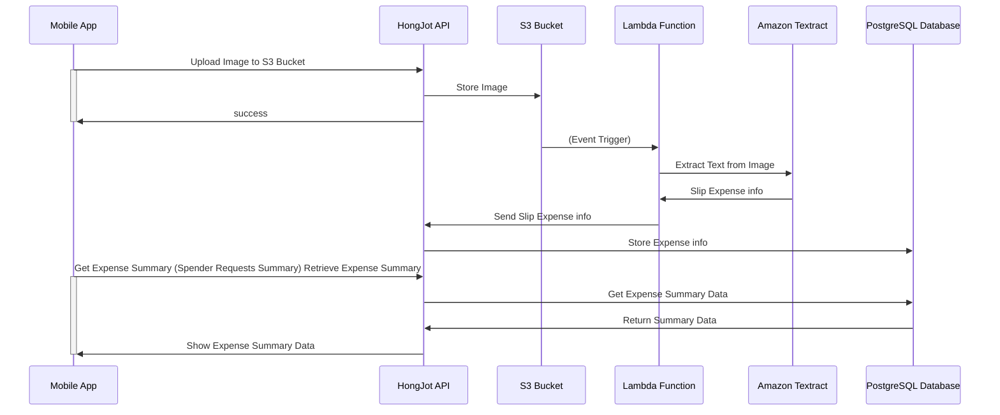

# Hongjot

HongJot is a mobile app that helps spenders to track their expenses. Spenders can take a picture of their receipts and the app will extract the expense information from the image. The app will then store the expense information in a database and provide a summary of the expenses to the spender.

# HongJot Diagram

